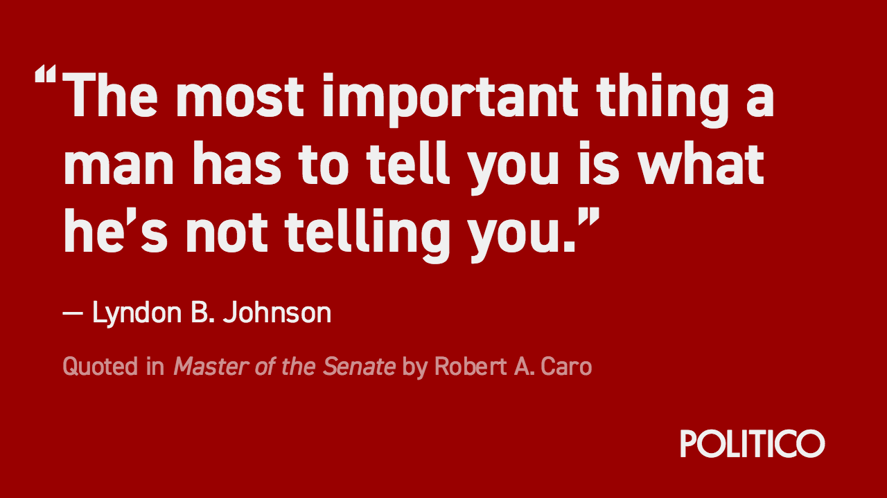

# Second Lunch



### What's in here?

Second Lunch is a set of tools used to create shareable social media cards. Currently, it only contains Quotable, a tool for creating quote cards.

Second Lunch is based off of NPR's [Lunchbox](https://github.com/nprapps/lunchbox), but is a complete rewrite of the technology. The goal is to package it with all the trappings of modern Javascript, and use that to create reusable components that make customization far easier.

### Customizing Second Lunch

To customize Second Lunch for your purposes, first follow the [development instructions](#development) to get the app running locally.

Then, you can customize your themes in `src/js/themes.json`. Each object in JSON file contains a theme. Write your themes like this:

1. The key to the object is the name of the theme. This will display in the theme selection dropdown.
2. Each of the nested "styles" objects lets you write any CSS property to override the defaults of a particular piece of the card. For example `quoteStyles` lets you override the quote on the page, while `sourceStyles` lets you override the source line.
3. Set the branding to the name of the brand React component the theme should use. Read more about this [below](#branding).

#### Branding

The bottom right of every card contains branding for the card. At POLITICO, we have multiple brands that we need cards for, so this piece needed to be flexible.

To get your branding into the card, create a new file in `src/js/components/branding/`. In this file, create a React component that defines the markup you want. Use any of the other files as an example.

Then, open `src/js/components/branding/index.js`, import your new component, and attach it to the exported object.

Now, if you define a new theme in `src/js/themes.json`, you should be able to use the name of your component as the value for `branding`. When you select the theme in the editor, the branding should appear as you defined it in your React component.

### Development

To start developing with this repository, run the following:

```
$ npm install
$ npm run start
```

Then, visit http://localhost:3000 in your browser. You should see the page load.

### Other development commands

##### Build to `dist/`

```
$ npm run build
```

##### Build to `docs/` for publishing as GitHub page

```
$ npm run build:gitpage
```

##### Build and publish page to AWS S3 bucket

1. Make sure you have [AWS credentials stored in your user profile](https://docs.aws.amazon.com/cli/latest/userguide/cli-config-files.html).

2. Configure AWS settings in package.json.

3. Run publish command:

  ```
  $ npm run publish:aws
  ```

